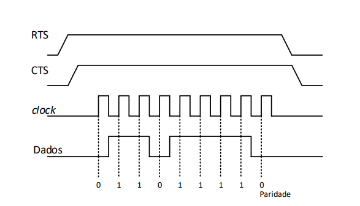
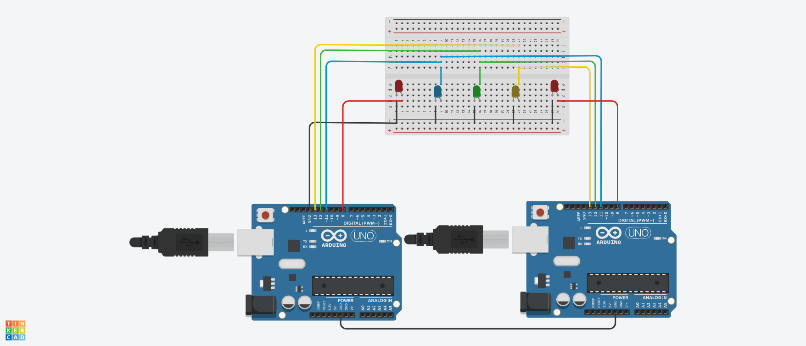
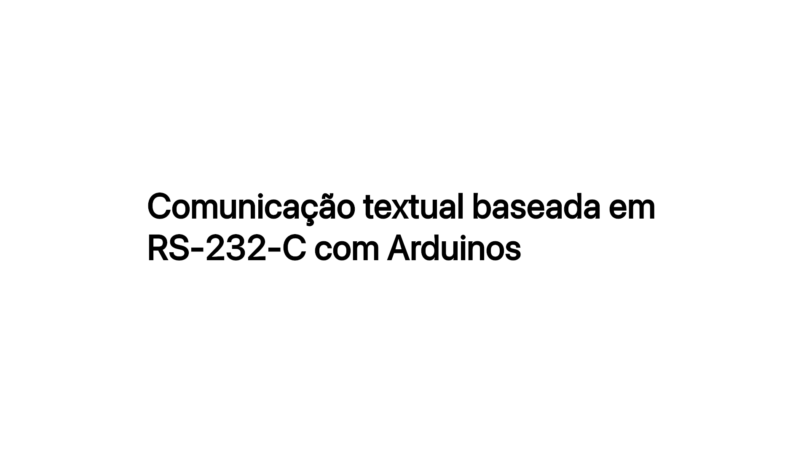

# RS-232 síncrono customizado com Arduino

> Projeto de comunicação síncrona entre dois Arduinos, customizado com base no protocolo [RS-232](https://en.wikipedia.org/wiki/RS-232), desenvolvido como requisito parcial da disciplina de Redes de Computadores (SCC0142) do ICMC/USP, no primeiro semestre de 2022.

## Especificação dos requisitos do projeto

1. A comunicação entre os Arduinos deve ser síncrona, de forma com que emissor e receptor interajam através de *clock*;

2. A comunicação deve implementar controle de erros através de bit de paridade;

3. A comunicação deve contar com *handshake* para transmissão dos dados.

## Esquema de sinais esperado

Conforme apresenta a figura abaixo, a comunicação deve ser feita através de dos sinais de *handshake*, **RTS** e **CTS**, além da transmissão de dados. Por se tratar de uma solução síncrona, também consta um sinal de *clock*. Para a checagem de erros, há a aplicação de **paridade ímpar** para todos os caracteres transmitidos e recebidos. Caso haja erro e não seja atingida a paridade esperada, é exibido um ``*``.

  

## Circuito

Foi construído um protótipo com auxílio da ferramenta [TinkerCad](https://www.tinkercad.com/things/63d6NgXvJmt?sharecode=QsHwRUV66H45Ul2y8hSWyR613NitcmovdFFgzNKH6hI), usando duas placas Arduino Uno, uma *breadboard* e LEDS de controle de *handshake* e *clock*. Para testar, clique em ``simulate``, abra o código em ``code``, abra o monitor serial em ``Serial Monitor`` e altere entre os Arduinos ``1`` e ``2``, receptor e transmissor, para enviar e acompanhar a chegada das mensagens.

  

## Decisões de projeto

A solução foi implementada considerando a transmissão individual de caracteres em detrimento da solução de envio completo de frases. Assim, a cada caractere enviado, é realizado um novo *handshake*; foram dispensados, dessa forma, bits de início e fim de transmissão no canal de dados.

## Funcionamento

  

## Estudantes

* Matheus Henrique de Cerqueira Pinto (11911104)
* Pedro Henrique Dias Junqueira de Souza (11294312)
* Tarcídio Antonio Junior (10748347)
